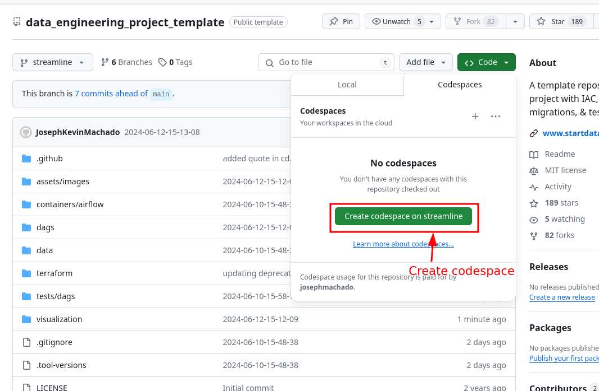
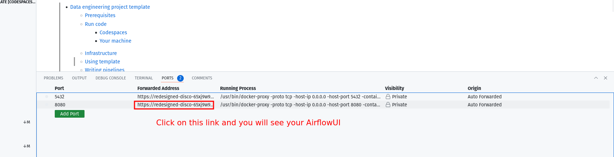
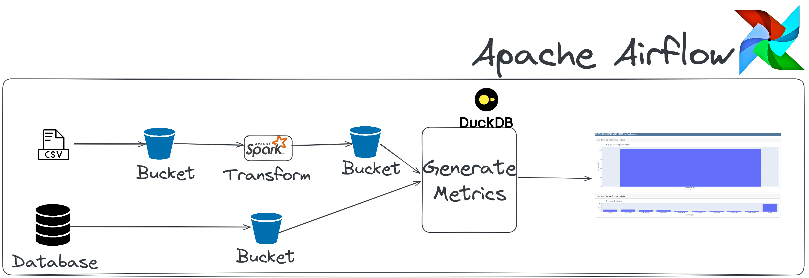
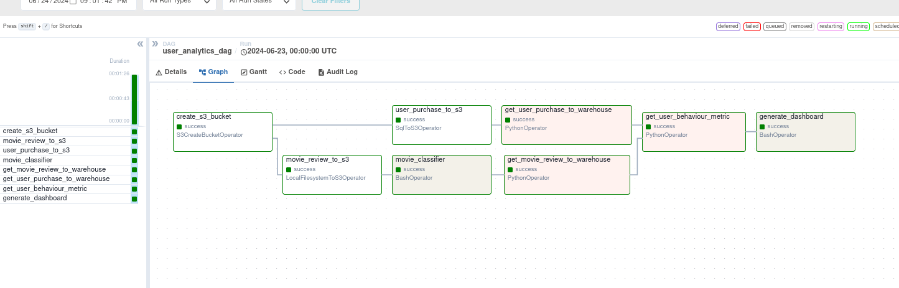

* [Beginner DE Project - Batch Edition](#beginner-de-project---batch-edition)
    * [Run Data Pipeline](#run-data-pipeline)
        * [Run on codespaces](#run-on-codespaces)
        * [Run locally](#run-locally)
    * [Architecture](#architecture)

# Beginner DE Project - Batch Edition

Code for blog at [Data Engineering Project for Beginners](https://www.startdataengineering.com/post/data-engineering-project-for-beginners-batch-edition/).

## Run Data Pipeline

Code available at **[beginner_de_project](https://github.com/josephmachado/beginner_de_project)** repository.

### Run on codespaces

You can run this data pipeline using GitHub codespaces. Follow the instructions below.

1. Create codespaces by going to the **[beginner_de_project](https://github.com/josephmachado/beginner_de_project)** repository, cloning it(or click `Use this template` button) and then clicking on `Create codespaces on main` button.
2. Wait for codespaces to start, then in the terminal type `make up`.
3. Wait for `make up` to complete, and then wait for 30s (for Airflow to start).
4. After 30s go to the `ports` tab and click on the link exposing port `8080` to access Airflow UI (username and password is `airflow`).





**Note** Make sure to switch off codespaces instance, you only have limited free usage; see docs [here](https://github.com/features/codespaces#pricing).

### Run locally

To run locally, you need:

1. [git](https://git-scm.com/book/en/v2/Getting-Started-Installing-Git)
2. [Github account](https://github.com/)
3. [Docker](https://docs.docker.com/engine/install/) with at least 4GB of RAM and [Docker Compose](https://docs.docker.com/compose/install/) v1.27.0 or later

Clone the repo and run the following commands to start the data pipeline:

```bash
git clone https://github.com/josephmachado/beginner_de_project.git
cd beginner_de_project 
make up
sleep 30 # wait for Airflow to start
make ci # run checks and tests
```

Go to [http:localhost:8080](http:localhost:8080) to see the Airflow UI. Username and password are both `airflow`.

## Architecture

This data engineering project, includes the following:

1. **`Airflow`**: To schedule and orchestrate DAGs.
2. **`Postgres`**: To store Airflow's details (which you can see via Airflow UI) and also has a schema to represent upstream databases.
3. **`DuckDB`**: To act as our warehouse
4. **`Quarto with Plotly`**: To convert code in `markdown` format to html files that can be embedded in your app or servered as is.
5. **`Apache Spark`**: To process our data, specifically to run a classification algorithm.
6. **`minio`**: To provide an S3 compatible open source storage system.

For simplicity services 1-5 of the above are installed and run in one container defined [here](./containers/airflow/Dockerfile).



The `user_analytics_dag` DAG in the [Airflow UI](http://localhost:8080) will look like the below image:



On completion, you can see the dashboard html rendered at[./dags/scripts/dashboard/dashboard.html](./dags/scripts/dashboard/dashboard.html).

Read **[this post](https://www.startdataengineering.com/post/data-engineering-projects-with-free-template/)**, for information on setting up CI/CD, IAC(terraform), "make" commands and automated testing.

