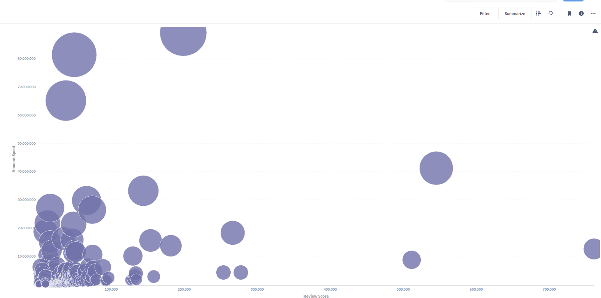
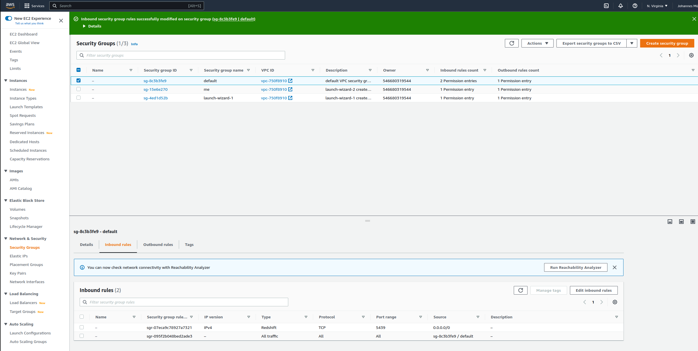

# E-commerce Data Batch Processing pipeline
* extended from https://github.com/josephmachado/beginner_de_project

- [E-commerce Data Batch Processing pipeline](#e-commerce-data-batch-processing-pipeline)
  - [Design](#design)
  - [Extra Features](#extra-features)
  - [ERROR HANDLING](#error-handling)

## Design

We will be using Airflow to orchestrate

1. Classifying movie reviews with Apache Spark.
2. Loading the classified movie reviews into the data warehouse.
3. Extract user purchase data from an OLTP database and load it into the data warehouse.
4. Joining the classified movie review data and user purchase data to get `user behavior metric` data.

* NOTE: start the same airflow docker locally, then use port forwarding to send request to airflow docker running on EC2

## Extra Features
### 1. Adding Extra Airflow Steps
a. Install ElasticSearch on EMR
b. Calculate recommendataion embedding of products using AWS EMR and save to EMR ES
   * TODO: is there a way that EMR can save results to OpenSearch directly
c. recommendation api query EMR ES

### 2. Recommendataion api serving 
* Build a real-time recommendation api using fastapi and elasticsearch

### 3. Spark data skew analysis and optimization
* TODO

## ERROR HANDLING
1. Error1: make infra-up
   
         could not start transaction: dial tcp xx.xxx.xxx.xx:5439: connect: operation timed out │ │ with redshift_schema.external_from_glue_data_catalog, │ on main.tf line 170, in resource "redshift_schema" "external_from_glue_data_catalog": │ 170: resource "redshift_schema" "external_from_glue_data_catalog"
   * Solved it by editing the Source of the Inbound Rules of the EC2 Default Security Group (SG) to my IP Address. Just get into EC2 Dashboard via AWS Console and the list of SG is under the Network & Security tab. There is multiple SG and you have to edit the 'default' EC2 SG only.
    https://aws.amazon.com/premiumsupport/knowledge-center/private-redshift-cluster-local-machine/
    https://stackoverflow.com/questions/67729058/add-a-security-group-to-the-inbound-rule-of-another-security-group-as-a-source-w

2. Error2: make cloud-airflow 
   
         bind [127.0.0.1]:8082: Address already in use
         channel_setup_fwd_listener_tcpip: cannot listen to port: 8082
         Could not request local forwarding.
   * kill process (lsof -i:port) listening on port first

3. Error3: Airflow Error
   
         could not connect to server: Connection timed out 
         Is the server running on host "alande-redshift-cluster.c2uknbxe8vtj.us-east-1.redshift.amazonaws.com" (172.31.0.228) and accepting TCP/IP connections on port 5439
   * 檢查 redshift security group inbound rule 是不是長這樣 
     

   * how to make terraform aws_security_group type = Redshift???
