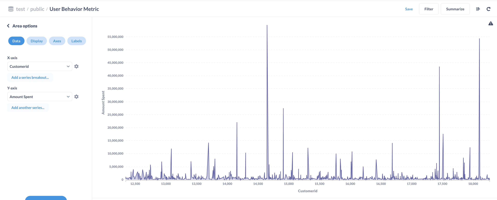

# Beginner DE Project - Batch Edition

### See detailed explanation at [Data engineering project: Batch edition](https://www.startdataengineering.com/post/data-engineering-project-for-beginners-batch-edition)

- [Beginner DE Project - Batch Edition](#beginner-de-project---batch-edition)
    - [See detailed explanation at Data engineering project: Batch edition](#see-detailed-explanation-at-data-engineering-project-batch-edition)
  - [Design](#design)
  - [Setup](#setup)
    - [Prerequisite](#prerequisite)
    - [Local run](#local-run)
    - [Deploy to AWS](#deploy-to-aws)
  - [Stop](#stop)
  - [Contributing](#contributing)

## Design

We will be using Airflow to orchestrate

1. Classifying movie reviews with Apache Spark.
2. Loading the classified movie reviews into the data warehouse.
3. Extract user purchase data from an OLTP database and load it into the data warehouse.
4. Joining the classified movie review data and user purchase data to get `user behavior metric` data.


## Setup

### Prerequisite

1. [Docker](https://docs.docker.com/engine/install/) with at least 4GB of RAM and [Docker Compose](https://docs.docker.com/compose/install/) v1.27.0 or later
2. [psql](https://blog.timescale.com/tutorials/how-to-install-psql-on-mac-ubuntu-debian-windows/)
3. [AWS account](https://aws.amazon.com/)
4. [AWS CLI installed](https://docs.aws.amazon.com/cli/latest/userguide/install-cliv2.html) and [configured](https://docs.aws.amazon.com/cli/latest/userguide/cli-chap-configure.html)

Clone and cd into the project directory.

```bash
git clone https://github.com/josephmachado/beginner_de_project.git
cd beginner_de_project
```

### Local run

When running locally, you can use the make command to manage infrastructure. We use the following docker containers 

1. Airflow
2. Postgres DB (as Airflow metadata DB)
3. Metabase for data visualization

You can start the local containers as shown below.

```bash
make up # start all containers
make ci # runs format checks, type checks, static checks, and tests
make down # stops the containers
```

Since we cannot replicate AWS components locally, we have not set them up here. To learn more about how to set up components locally [read this article](https://www.startdataengineering.com/post/setting-up-e2e-tests/)

We have a dag validity test defined [here](test/dag/test_dag_validity.py).

### Deploy to AWS

To set up the AWS infrastructure we have a script called `setup_infra.sh`. 

**Note:** We run all of our infrastructure on AWS us-east-1. If you want to change this, please change the corresponding variables in [infra_variables.txt](infra_variables.txt).

Setup can be run as shown below.

```bash
make down # since our AWS infra will be port forwarded to 8080 and 3000 which are used by local Airflow and Metabase respectively
./setup_infra.sh {your-bucket-name} # e.g ./setup_infra.sh my-test-bucket 
```

In the prompt enter `yes` to authenticate the ssh connection.

This sets up the following components

1. 1 AWS EC2, running Airflow, Metabase
2. 1 AWS EMR cluster
3. 1 AWS Redshift cluster
4. 1 AWS S3 bucket

The command will also open Airflow running on an EC2 instance. You can also checkout

1. Airflow [www.localhost:8080](http://localhost:8080) (username and password are both `airflow`)
2. Metabase [www.localhost:3000](http://localhost:3000) 

The first time you log in, create a user name and password. To establish a connection to your Redshift cluster, you will need the redshift host, which you can get using the command 

```bash
aws redshift describe-clusters --cluster-identifier sde-batch-de-project --query 'Clusters[0].Endpoint.Address' --output text
```

The port, username, and password are in [infra_vairables.txt](infra_variables.txt) and the database is `dev`. 

You can create dashboards in Metabase, as seen below.



## Stop

When you are done, do not forget to turn off your AWS instances. In your terminal run

```bash
./tear_down_infra.sh {your-bucket-name} # e.g. ./tear_down_infra.sh my-test-bucket
```

This will stop all the AWS services. Please double-check this by going to the AWS UI S3, EC2, EMR, & Redshift consoles.

## Contributing

Contributions are welcome. If you would like to contribute you can help by opening a Github issue or putting up a PR.
