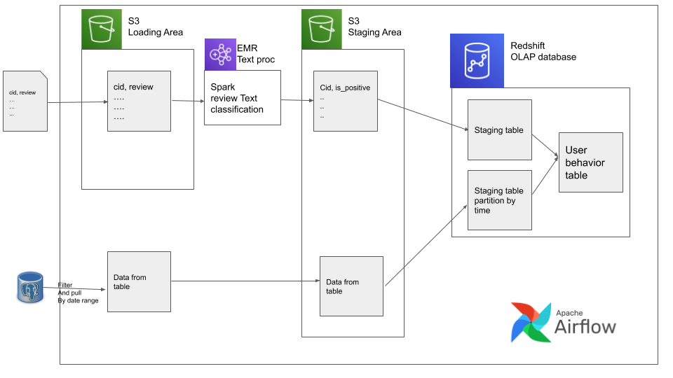
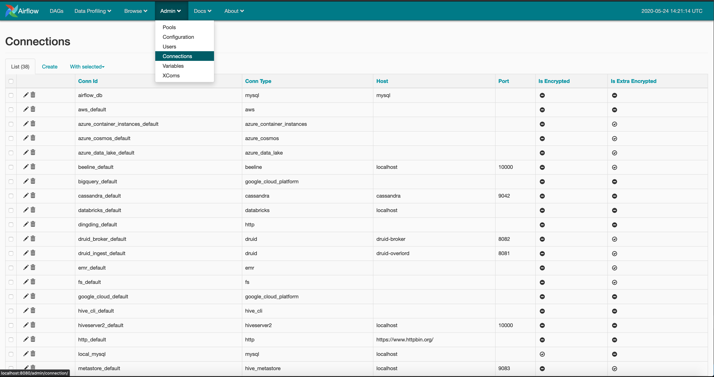
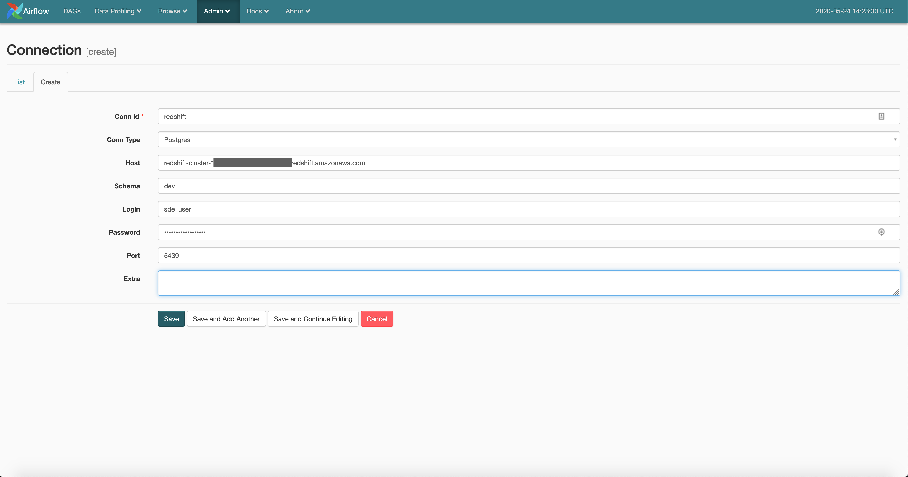

# Beginner DE Project - Batch Edition

If you are interested in step by step explanation and review, check out the post for this repo at
[project-for-beginners-batch-edition](https://www.startdataengineering.com/post/data-engineering-project-for-beginners-batch-edition)

## Prereq

1. [docker](https://docs.docker.com/get-docker/) (also make sure you have `docker-compose`) we will use this to run Airflow locally
2. [pgcli](https://github.com/dbcli/pgcli) to connect to our databases(postgres and Redshift)
3. [AWS account](https://aws.amazon.com/) to set up our cloud components
4. [AWS Components](https://www.dropbox.com/s/ql8wxqjjcv42065/aws-components-setup.pdf?dl=0) to start the required services

By the end of the setup you should have(or know how to get)

1. `aws cli` configured with keys and region
2. `pem or ppk` file saved locally with correct permissions
3. `ARN` from your `iam` role for Redshift
4. `S3` bucket
5. `EMR ID` from the summary page
6. `Redshift` host, port, database, username, password

## Design



## Data

Data is available at [data](https://www.dropbox.com/sh/amdyc6z8744hrl5/AAC2Fnbzb_nLhdT2nGjL7-7ta?dl=0).Place this folder within the `setup` folder as such `setup/raw_input_data/`

## Setup and run

### local

In you local terminal type within your project base directory

```bash
docker-compose -f docker-compose-LocalExecutor.yml up -d
```

Then wait a couple seconds and sign into the Airflow `postgres` metadata database(since our data is small we pretend that our metadata database is also our OLTP datastore)

```bash
pgcli -h localhost -p 5432 -U airflow
```

and run the script at `setup/postgres/create_user_purchase.sql`.

### Redshift

Get the redshift cluster connection details and make sure you have a spectrum IAM role associated with it(as shown in [AWS Components](https://www.dropbox.com/s/ql8wxqjjcv42065/aws-components-setup.pdf?dl=0) )
log into redshift using `pgcli`

```bash
pgcli -h <your-redshift-host> -p 5439 -d <your-database> -U <your-redshift-user>
# type password when prompted
```

In the redshift connection run the script at `setup/redshift/create_external_schema.sql`, after replacing it with your `iam` role ARN and s3 bucket.

log on to [www.localhost:8080](http://localhost:8080) to see the Airflow UI
Create a new connection as shown below for your 'redshift'




### EMR

Get your EMR ID from the EMR UI, then in `dags/user_behaviour.py` fill out your `BUCKET_NAME` and `EMR_ID`.

switch on your `DAG`, after running successfully, verify the presence of data in redshift using
`select * from  public.user_behavior_metric limit 10;`.

## Stop

From your AWS console, stop the redshift cluster and EMR cluster
In you local terminal type within your project base directory
```bash
docker-compose -f docker-compose-LocalExecutor.yml down
```