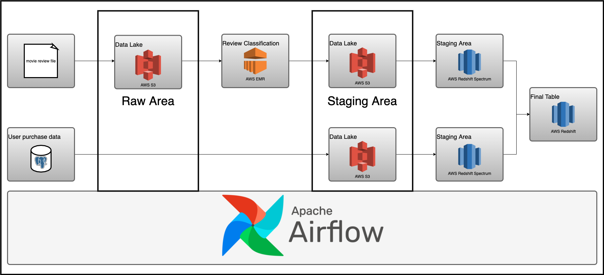

# Beginner DE Project - Batch Edition

### See detailed explanation at [Data engineering project: Batch edition](https://www.startdataengineering.com/post/data-engineering-project-for-beginners-batch-edition)

- [Beginner DE Project - Batch Edition](#beginner-de-project---batch-edition)
    - [See detailed explanation at Data engineering project: Batch edition](#see-detailed-explanation-at-data-engineering-project-batch-edition)
  - [Design](#design)
  - [Setup](#setup)
    - [Prerequisite](#prerequisite)
    - [Tear down infra](#tear-down-infra)
  - [Contributing](#contributing)

## Design

We will be using Airflow to orchestrate

1. Classifying movie reviews with Apache Spark.
2. Loading the classified movie reviews into the data warehouse.
3. Extract user purchase data from an OLTP database and load it into the data warehouse.
4. Joining the classified movie review data and user purchase data to get `user behavior metric` data.



## Setup

### Prerequisite

1. [git](https://git-scm.com/book/en/v2/Getting-Started-Installing-Git)
2. [Github account](https://github.com/)
3. [Terraform](https://learn.hashicorp.com/tutorials/terraform/install-cli) 
4. [AWS account](https://aws.amazon.com/) 
5. [AWS CLI installed](https://docs.aws.amazon.com/cli/latest/userguide/install-cliv2.html) and [configured](https://docs.aws.amazon.com/cli/latest/userguide/cli-chap-configure.html)
6. [Docker](https://docs.docker.com/engine/install/) with at least 4GB of RAM and [Docker Compose](https://docs.docker.com/compose/install/) v1.27.0 or later
7. [psql](https://blog.timescale.com/tutorials/how-to-install-psql-on-mac-ubuntu-debian-windows/)

Read **[this post](https://www.startdataengineering.com/post/data-engineering-projects-with-free-template/)**, for information on setting up CI/CD, DB migrations, IAC(terraform), "make" commands and automated testing.

Run these commands to setup your project locally and on the cloud.

```shell
# Clone and cd into the project directory.
git clone https://github.com/josephmachado/beginner_de_project.git
cd beginner_de_project

# Local run & test
make up # start the docker containers on your computer & runs migrations under ./migrations
make ci # Runs auto formatting, lint checks, & all the test files under ./tests

# Create AWS services with Terraform
make tf-init # Only needed on your first terraform run (or if you add new providers)
make infra-up # type in yes after verifying the changes TF will make

# Create Redshift Spectrum tables (tables with data in S3)
make spectrum-migration
# Create Redshift tables
make redshift-migration

# Wait until the EC2 instance is initialized, you can check this via your AWS UI
# See "Status Check" on the EC2 console, it should be "2/2 checks passed" before proceeding
# Wait another 5 mins, Airflow takes a while to start up

make cloud-airflow # this command will forward Airflow port from EC2 to your machine and opens it in the browser
# the user name and password are both airflow

make cloud-metabase # this command will forward Metabase port from EC2 to your machine and opens it in the browser
```

To get Redshift connection credentials for `metabase`  use these commands.

```bash
make infra-config
# use redshift_dns_name as host
# use redshift_user & redshift_password
# dev as database
```

Since we cannot replicate AWS components locally, we have not set them up here. To learn more about how to set up components locally [read this article](https://www.startdataengineering.com/post/setting-up-e2e-tests/)

Create [database migrations](https://www.startdataengineering.com/post/data-engineering-projects-with-free-template/#43-database-migrations) as shown below.

```shell
make db-migration # enter a description, e.g., create some schema
# make your changes to the newly created file under ./migrations
make redshift-migration # to run the new migration on your warehouse
```

For the [continuous delivery](https://github.com/josephmachado/beginner_de_project/blob/master/.github/workflows/cd.yml) to work, set up the infrastructure with terraform, & defined the following repository secrets. You can set up the repository secrets by going to `Settings > Secrets > Actions > New repository secret`.

1. **`SERVER_SSH_KEY`**: We can get this by running `terraform -chdir=./terraform output -raw private_key` in the project directory and paste the entire content in a new Action secret called SERVER_SSH_KEY.
2. **`REMOTE_HOST`**: Get this by running `terraform -chdir=./terraform output -raw ec2_public_dns` in the project directory.
3. **`REMOTE_USER`**: The value for this is **ubuntu**.

We have a dag validity test defined [here](test/dag/test_dag_validity.py).

### Tear down infra

After you are done, make sure to destroy your cloud infrastructure.

```shell
make down # Stop docker containers on your computer
make infra-down # type in yes after verifying the changes TF will make
```

This will stop all the AWS services. Please double-check this by going to the AWS UI S3, EC2, EMR, & Redshift consoles.

## Contributing

Contributions are welcome. If you would like to contribute you can help by opening a Github issue or putting up a PR.
