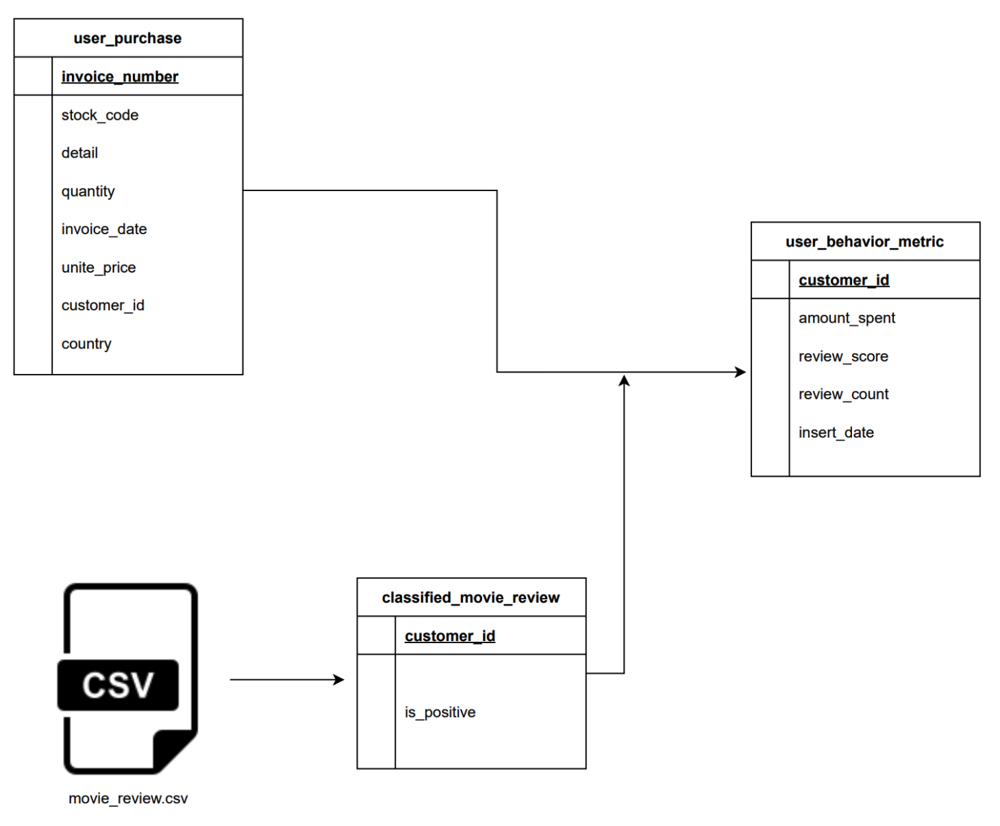
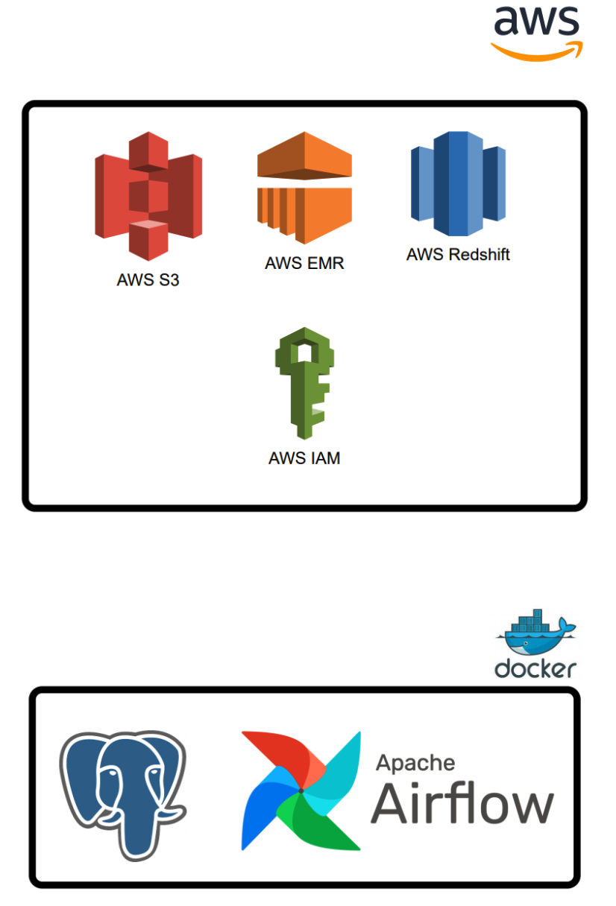

# Beginner DE Project - Batch Edition

If you are interested in step by step explanation and design review, check out the post for this repo at
[project-for-beginners-batch-edition](https://www.startdataengineering.com/post/data-engineering-project-for-beginners-batch-edition)

- [Beginner DE Project - Batch Edition](#beginner-de-project---batch-edition)
  - [1. Introduction](#1-introduction)
  - [2. Objective](#2-objective)
  - [3. Design](#3-design)
  - [4. Setup](#4-setup)
    - [4.1 Prerequisite](#41-prerequisite)
  - [5. Stop](#5-stop)
  - [6. Contributing](#6-contributing)

## 1. Introduction

A real data engineering project usually involves multiple components. Setting up a data engineering project, while conforming to best practices can be extremely time-consuming. If you are

> A data analyst, student, scientist, or engineer looking to gain data engineering experience, but is unable to find a good starter project.

> Wanting to work on a data engineering project that simulates a real-life project.

> Looking for an end-to-end data engineering project.

> Looking for a good project to get data engineering experience for job interviews.

Then this tutorial is for you. In this tutorial, you will

1. Setup Apache Airflow, AWS EMR, AWS Redshift, AWS Spectrum, and AWS S3.

2. Learn data pipeline best practices.

3. Learn how to spot failure points in a data pipeline and build systems resistant to failures.

4. Learn how to design and build a data pipeline from business requirements.

## 2. Objective

Let's assume that you work for a user behavior analytics company that collects user data and creates a user profile. We are tasked with building a data pipeline to populate the `user_behavior_metric` table. The `user_behavior_metric` table is an OLAP table, meant to be used by analysts, dashboard software, etc. It is built from

1. `user_purchase`: OLTP table with user purchase information.
2. `movie_review.csv`: Data sent every day by an external data vendor.



## 3. Design

We will be using Airflow to orchestrate

1. Classifying movie reviews with Apache Spark.
2. Loading the classified movie reviews into the data warehouse.
3. Extracting user purchase data from an OLTP database and loading it into the data warehouse.
4. Joining the classified movie review data and user purchase data to get `user behavior metric` data.


## 4. Setup

### 4.1 Prerequisite

1. [Docker](https://docs.docker.com/engine/install/) with at least 4GB of RAM and [Docker Compose](https://docs.docker.com/compose/install/) v1.27.0 or later
2. [psql](https://blog.timescale.com/tutorials/how-to-install-psql-on-mac-ubuntu-debian-windows/)
3. [AWS account](https://aws.amazon.com/)
4. [AWS CLI installed](https://docs.aws.amazon.com/cli/latest/userguide/install-cliv2.html) and [configured](https://docs.aws.amazon.com/cli/latest/userguide/cli-chap-configure.html)

To set up the infrastructure and base tables we have a script called `setup_infra.sh`. This can be run as shown below.

```bash
git clone https://github.com/josephmachado/beginner_de_project.git
cd beginner_de_project
./setup_infra.sh {your-bucket-name}
```

This sets up the following components


log on to [www.localhost:8080](http://localhost:8080) to see the Airflow UI. The username and password are both `airflow`.

## 5. Stop

When you are done, do not forget to turn off your instances. In your terminal run

```bash
./spindown_infra.sh {your-bucket-name}
```

To stop all your AWS services and local docker containers.

## 6. Contributing

Contributions are welcome. If you would like to contribute you can help by opening a github issue or putting up a PR.
